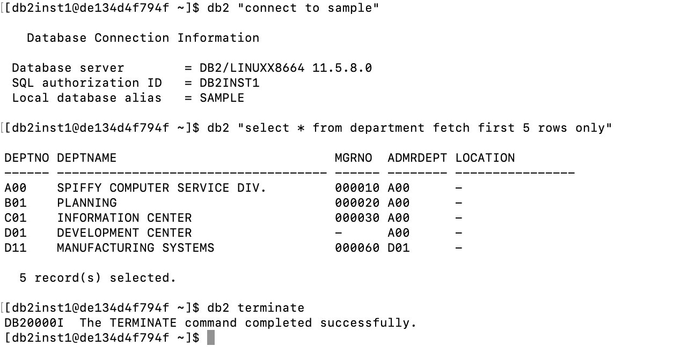
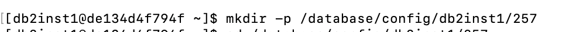

# CS257 HW2 — macOS Docker + Embedded SQL (Super Easy Guide)


> Works on Intel and Apple Silicon (M1/M2/M3). If you’ve tried things before, start at **0. Clean Slate**.

---

## Table of Contents

1. [Prereqs](#prereqs)
2. [0. Clean Slate (optional)](#0-clean-slate-optional)
3. [1. Pull & Run Db2 in Docker](#1-pull--run-db2-in-docker)
4. [2. Create the SAMPLE database](#2-create-the-sample-database)
5. [3. Quick sanity test (SQL script)](#3-quick-sanity-test-sql-script)
6. [4. Build & run professor’s `sample2.sqc` (optional)](#4-build--run-professors-sample2sqc-optional)
7. [5. Build & run **your** `h2.sqc` (the assignment)](#5-build--run-your-h2sqc-the-assignment)
8. [6. Exit, restart later, and submission](#6-exit-restart-later-and-submission)

---

## Prereqs

* ⬜ Install **Docker Desktop** for macOS (via website or Homebrew):

  ```bash
  # If you use Homebrew
  brew install --cask docker
  ```
* ⬜ Start Docker Desktop and let it finish starting up (whale icon should be steady)
* ⬜ Open **Terminal** (or iTerm)

> **Apple Silicon (M‑series) only** — set the platform once in this Terminal tab:

```bash
export DOCKER_DEFAULT_PLATFORM=linux/amd64
```


---

## 0. Clean Slate (optional)

Use if you previously created containers/volumes.

* ⬜ Remove any old container named `mydb2`:

  ```bash
  docker rm -f mydb2 2>/dev/null || true
  ```
  
* ⬜ Remove any old volume we’ll reuse:

  ```bash
  docker volume rm luw 2>/dev/null || true
  ```
  
> Note: here luw was the volume used to mount you can replace with your configured mount directory

---

## 1. Pull & Run Db2 in Docker

* ⬜ Pull the image (first time only):

  ```bash
  docker pull ibmcom/db2
  ```
> If this throws an error its because you did not run the comand 
export DOCKER_DEFAULT_PLATFORM=linux/amd64


* ⬜ Start the container with a named volume (**recommended on macOS**):

  ```bash
  docker run -itd --name mydb2 --privileged=true -p 50000:50000 \
    -e LICENSE=accept \
    -e DB2INST1_PASSWORD='password' \
    -e DBNAME=testdb \
    -v luw:/database \
    ibmcom/db2
  ```

  * You can change `'password'` to any password you like.

* ⬜ Enter the container as the Db2 instance user:

  ```bash
  docker exec -ti mydb2 bash -lc "su - db2inst1"
  ```


> **Tip (file sharing):** If you ever bind‑mount a host path, use something under `$HOME` (e.g., `-v "$HOME/DBMS":/database`) and make sure it’s shared in Docker Desktop → Settings → Resources → File Sharing. For this guide we avoid bind mounts by using the **named volume** `luw`.

---

## 2. Create the SAMPLE database

Inside the container (your prompt should look like `db2inst1@<something> ~`):

* ⬜ Start Db2 (safe even if already started):

  ```bash
  db2start
  ```
  > Note if you see an error like the below "command not found"
  
  then run sudo su - and put the password as "password"
* ⬜ Create the SAMPLE database (takes ~1–2 min):

  ```bash
  db2sampl
  ```

  
* ⬜ Test a connection and a small query:

  ```bash
  db2 "connect to sample"
  db2 "select * from department fetch first 5 rows only"
  db2 terminate
  ```



---

## 3. Quick sanity test (SQL script)

On your **Mac** (new Terminal tab in the folder you want):

* ⬜ Create `test.sql`:

  ```sql
  -- test.sql
  connect to sample;
  select count(*) as dept_rows from department;
  select count(*) as emp_rows  from employee;
  terminate;
  ```
* ⬜ Copy it into the container and run it:

  ```bash
  docker cp ./test.sql mydb2:/database/config/db2inst1/.
  docker exec -ti mydb2 bash -lc "su - db2inst1 -c 'db2 -tvf /database/config/db2inst1/test.sql'"
  ```

---

## 4. Build & run professor’s `sample2.sqc` (optional)

* ⬜ From your **Mac**, copy the file in:

  ```bash
  docker cp ./sample2.sqc mydb2:/database/config/db2inst1/.
  ```
* ⬜ Inside the container as `db2inst1` (same shell):

  ```bash
  db2 connect to sample
  db2 prep sample2.sqc
  gcc -I ./sqllib/include -c sample2.c
  gcc -o sample2 sample2.o -L ./sqllib/lib -ldb2
  ./sample2 sample | tee sample2.out
  ```


---

## 5. Build & run **your** `h2.sqc` (the assignment)

Put your `h2.sqc` in the same directory as above.

* ⬜ Copy from Mac → container:

  ```bash
  docker cp ./h2.sqc mydb2:/database/config/db2inst1/257/
  ```
  

  > If `257/` doesn’t exist yet: inside the container run `mkdir -p /database/config/db2inst1/257` first.



  

* ⬜ Inside the container as `db2inst1`:

  ```bash
  cd /database/config/db2inst1/257
  db2 connect to sample
  db2 prep h2.sqc
  gcc -I ../sqllib/include -c h2.c
  gcc -o h2 h2.o -L ../sqllib/lib -ldb2
  ./h2 sample | tee h2.out
  ```


---

## 6. Exit, restart later, and submission

* ⬜ Leave the Db2 CLP (if you ever enter interactive mode):

  ```
  db2 quit
  ```
* ⬜ Tidy up connection (optional):

  ```bash
  db2 connect reset
  db2 terminate
  ```
* ⬜ Exit the container shell:

  ```bash
  exit
  ```
* ⬜ Stop / start the container from your Mac later:

  ```bash
  docker stop mydb2
  docker start mydb2
  ```

### Grab files for submission (from your Mac)

* ⬜ Copy results out:

  ```bash
  docker cp mydb2:/database/config/db2inst1/257/h2.sqc ./
  docker cp mydb2:/database/config/db2inst1/257/h2.out ./
  docker cp mydb2:/database/config/db2inst1/257/readme.h2 ./  
  ```
* ⬜ Zip them:

  ```bash
  zip CS257_HW2_<YourLastName>.zip h2.sqc h2.out readme.h2
  ```

---